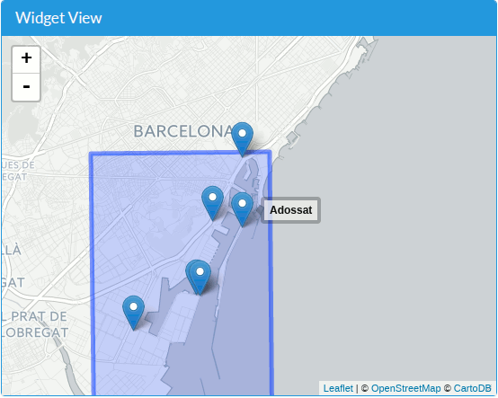
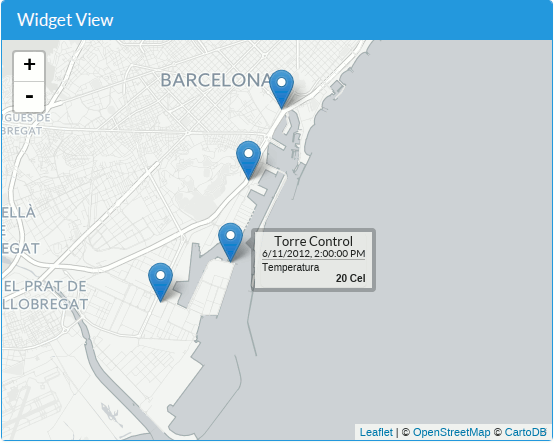
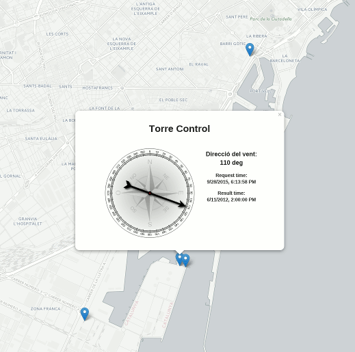
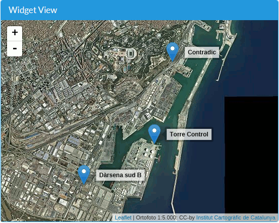
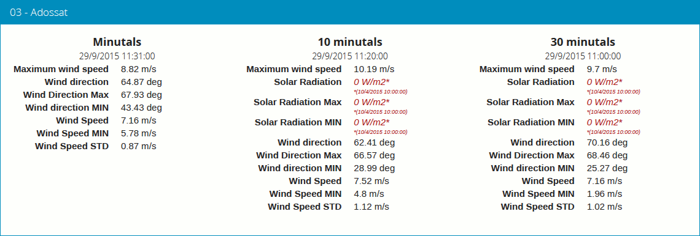

=====================
Los Widgets uno a uno
=====================

Rumbo (compass)
===============

El widget "compass" pertenece a la categoría de "valor instantáneo único". Muestra el último valor disponible para
una Property específica, que en este caso expresa un azimut o ángulo respecto al norte. El widget interrogará al servidor
periódicamente para actualizar el valor mostrado.

Sus parámetros obligatorios son:

* "service", "offering", "feature" y "property": determinan la propiedad cuyos valores quieren mostrarse. La propiedad debe tomar valores entre 0 y 360 (y la unidad de medida se supone que son grados centesimales).
* "refresh_interval" (en segundos): es el tiempo entre dos interrogaciones al servidor (el widget lanza GetObservations periódicas cada X segundos).

Otros parámetros opcionales:

* "title": Si no se especifica, por defecto se usa como título el nombre de la Feature.
* "footnote": Texto opcional que aparecerá como una pequeña nota al pie.
* "custom_css_url": hoja de estilos css que se aplicará al widget.

Manómetro (gauge)
=================

Otro widget de "valor instantáneo único", en esta ocasión para presentar valores de porcentaje entre 0 y 100.

Parámetros obligatorios:

* "service", "offering", "feature" y "property":  determinan la propiedad cuyos valores quieren mostrarse. La propiedad debe tomar valores entre 0 y 100 (y la unidad de medida se supone que es un tanto porciento).
* "refresh_interval" (en segundos): es el tiempo entre dos interrogaciones al servidor (el widget lanza GetObservations periódicas cada X segundos).

Parámetros opcionales:

* "footnote": Texto opcional que aparecerá como una pequeña nota al pie.
* "custom_css_url": hoja de estilos css que se aplicará al widget.

Tabla jQuery (jqgrid)
=====================

Muestra una `tabla jqGrid <http://www.trirand.com/blog/>`_ con un conjunto de observaciones para un período de tiempo determinado,
donde cada registro es una observación. La lista de resultados se muestra paginada y puede ser ordenada por los valores de cualquiera
de las columnas (Hora, Feature, Propiedad, Valor y Unidad de medida).

Parámetros obligatorios:

* "service", "offering", un conjunto de "features" y un conjunto de "properties": selecciona el conjunto de combinaciones feature-property a mostrar.
* "time_start" and "time_end": Selecciona las observaciones que caen dentro de este rango de tiempo.
* "title": el título del widget.

Parámetros opcionales:

* "footnote": Texto opcional que aparecerá como una pequeña nota al pie.
* "custom_css_url": hoja de estilos css que se aplicará al widget. Nótese que el aspecto de jqGrid se toma del tema jQuery-ui subyacente.

.. note:: este widget depende de jQuery, jQuery UI y el plugin jgGrid. Es un widget bastante pesado y no muy
   personalizable (se desarrolló como un ejercicio de integración con una aplicación existente). Se recomienda el uso de otros
   widgets como el "table", que van más en la línea de lo que pretenden ser los Sensor Widgets: ligeros, compactos y flexibles.

Mapa (map)
==========

Este widget es especial en varios sentidos. En primer lugar, muestra la respuesta a una petición GetFeatureOfInterest, en lugar del caso más
habitual en que un widget representa la respuesta a un GetObservation.

En segundo lugar, es un widget muy configurable, a través de algunos parámetros complejos. Afortunadamente la mayoría
de parámetros son opcionales, de modo que su uso más elemental es de hecho muy sencillo.

Está basado en la librería de mapas `Leaflet <http://leafletjs.com/>`_.

Los únicos parámetros estrictamente obligatorios son:

* "service" y "offering": Determinan el offering cuyos Features of Interest quieren mostrarse sobre el mapa.

Esto mostrará un mapa con las Features. Pasando el ratón por encima de una Feature, se mostrará una pequeña
etiqueta con el nombre de la feature.

   Mapa simple donde no se han indicado ni features ni properties.

Hay otro par de parámentros formalmente obligatorios (aunque pueden dejarse vacíos):

* "features": Podemos seleccionar sólo algunas features para mostrar en el mapa. Si no se indica ninguna, de hecho se mostrarán *todas* (no se aplica ningún filtrado). Pero este parámetro debe existir, aunque sea como una lista vacía.
* "properties": Si se indican una o más properties, la etiqueta de cada feature se convertirá de hecho en un pequeño widget de tipo "panel", mostrando los últimos valores de cada property para cada una de las features. Nuevamente, puede indicarse una ista vacía de properties, en cuyo caso, NO se mostrará ningún valor.

   Mapa donde se han seleccionado cuatro features y una property, cuyo valor se muestra en la etiqueta.

El parámetro opcional "permanent_tooltips", si toma el valor "true", hará que se muestren todas las etiquetas permanentemente, no sólo cuando
se pase el ratón por encima.

.. figure:: ../img/map-permanent-tooltips.png
   :align: center

   Mapa con etiquetas permanentes.

Además de las etiquetas, también podemos vincular un sub-widget a cada feature, que se mostrará en un globo al hacer clic sobre ella.
El parámetro "popup_widget" toma como valor un JSON de configuración de dicho sub-widget. En esta configuracion, los parámetros "service", "offering" y
"feature(s)" se obtienen del widget *padre* (el mapa), así que no deben indicarse. La propiedad "name" indica qué clase de widget queremos incrustar.

Por ejemplo, si queremos que se abra un globo conteniendo una gráfica temporal al hacer clic en cada feature, debemos indicar:

   * "name": "timechart",
   * ...todos los parámetros del widget timechart, excepto "service" y "offering".

Es decir::

   {
       "name": "timechart",
       "title": "Temperatures",
       "properties": [
           "http://sensors.portdebarcelona.cat/def/weather/properties#32M",
           "http://sensors.portdebarcelona.cat/def/weather/properties#32",
           "http://sensors.portdebarcelona.cat/def/weather/properties#32N"
       ],
       "time_start": "2015-09-03T05:05:40Z",
       "time_end": "2015-09-03T08:05:40Z"
   }

   Mapa con un "popup_widget" de tipo "compass".

Además de personalizar las etiquetas y los globos con detalles acerca de cada feature, podemos cambiar la cartografía
de base del mapa mediante el parámetro "base_layer". Se pueden especificar dos tipos de capa base:

* Una capa de teselas: Debe indicarse una "url" y un conjunto de "options". Por ejemplo::

   {
      "url": "http://{s}.tile.openstreetmap.org/{z}/{x}/{y}.png",
      "options": {
	     "maxZoom": 19,
	     "attribution": "&copy; <a href='http://www.openstreetmap.org/copyright'>OpenStreetMap contributors</a>"
	  }
   }

Los parámetros "url" y "options" se corresponden con los parámetros del `constructor TileLayer de Leaflet <http://leafletjs.com/reference.html#tilelayer>`_
"urlTemplate" y "TileLayer_options" respectivamente.

Se puede escoger entre una buena colección de capas de teselas: http://leaflet-extras.github.io/leaflet-providers/preview/

* Una capa WMS: Debe especificarse "type"="wms", una "url" y un conjunto de "options". Por ejemplo::

   {
      "type": "wms",
      "url": "http://geoserveis.icc.cat/icc_mapesbase/wms/service",
      "options": {
         "layers": "orto5m",
         "format": "image/jpeg",
         "attribution": "Ortofoto 1:5.000: CC-by <a href='http://www.icc.cat' target='_blank'>Institut Cartogràfic de Catalunya</a>"
      }
   }

   Mapa con cartografía WMS.

Los parámetros "url" y "options" se corresponden con los parámetros del `constructor TileLayer.WMS de Leaflet <http://leafletjs.com/reference.html#tilelayer-wms>`_
"baseUrl" y "TileLayer.WMS_options" respectivamente.

Otro parámetro opcional es "max_initial_zoom": Indica el nivel de zoom máximo a utilizar en la vista inicial del mapa.
Esto evita acercarse demasiado y perder contexto cartográfico, especialmente cuando se muestra una única feature puntual.

Por último, los parámetros opcionales habituales "footnote" y "custom_css_url" también están disponibles.

Véase un **ejemplo funcional completo** aquí: http://bl.ocks.org/oscarfonts/265d734349396cf4372c

Panel (panel)
=============

El widget "panel" se usa para mostrar los útimos valores de un conjunto de propiedades de una Feature dada. Está construido
como una Lista de Definiciones (<dl>) de HTML, compatible con las clases CSS de Bootstrap. El contenido del widget se actualizará automáticamente de forma periódica.

Sus parámetros obligatorios son:

* Los habituales "service", "offering" y "feature".
* Una lista de "properties" a mostrar.
* El "refresh_interval", en segundos.
* Un "title" para el panel.

Y los parámetros opcionales habituales: "footnote" y "custom_css_url".

El panel también mostrará la fecha de las observaciones como subtitulo. En caso de que alguno de los valores sea de una fecha anterior a la fecha común,
se mostará el valor en color rojo y se mostrará la fecha para dicha observación en particular.

   Tres widgets de tipo Panel, algunos de ellos mostrando valores antiguos.

Barra (progressbar)
===================

Otro widget que muestra un valor instantáneo, esta vez mostrado como una barra proporcional entre dos valores. Es útil para mostrar
gráficamente dónde cae un valor respecto a sus valores límite. Se puede usar para mostrar un porcentaje si se ajustan los valores
mínimo y máximo a 0 y 100 respectivamente, en cuyo caso sería muy similar a un widget de tipo "gauge" pero mostrando el valor
linealmente, pero "progressbar" también puede tomar otros valores límite distintos, con lo que es más flexible que "gauge". Además
el contenido es HTML, cuyo aspecto es más fácil de personalizar mediante CSS.

Parámetros obligatorios:

* Los habituales "service", "offering", "feature" y "property".
* "min_value" y "max_value", que determinan los valores extremos.
* "refresh_interval" en segundos.

Y los parámetros opcionales habituales: "footnote" y "custom_css_url".

Status (status)
===============

El widget "status" muestra el estado global de todo un offering de un vistazo. Dado un offering, construye una tabla cuyas
celdas representan todas las possibles combinaciones de feature-property. Para cada una, se muestra el último valor observado
y su antigüedad. Es una buena forma de inspeccionar el estado de salud de un offering: Si están llegando nuevas observaciones,
y para qué sensores.

Este widget está pensado como una herramienta de supervisón (una especie de hiper-tabla), y es más útil si se muestra a pantalla completa.

Sus únicos parámetros obligatorios son "service" y "offering".

Y los parámetros opcionales habituales: "footnote" y "custom_css_url".

Tabla (table)
=============

Dados un feature y un período de tiempo, un widget "table" muestra las observaciones de un conjunto de propiedades a lo
largo del tiempo. Es similar a "jqgrid" pero proporciona una vista más compacta. El widget es una simple tabla HTML con
clases CSS compatibles con Bootstrap.

Parámetros:

* Los habituales "service", "offering" y "feature".
* Una lista de "properties" a mostrar.
* "time_start" y "time_end": Período de tiempo del que quieren obtenerse observaciones.
* Y el "title".

Además de los parámetros opcionales comunes: "footnote" y "custom_css_url".

Termómetro (thermometer)
========================

Otro widget de tipo "valor instantáneo único", tal como Compass y Gauge, pero para mostrar una temperatura ambiental en grados Celsius.

Muestra el dibujo de un termómetro que puede tomar valores de los -24ºC a los 56ºC. También se muestra el valor numérico. Como otros widgets
de su categoría, incorpora un mecanismo de actualización periódica.

Parámetros obligatorios:

* "service", "offering", "feature" y "property": Determinan la property cuyos valores quieren mostrarse. Se le supone grados centígrados como unidad de medida.
* "refresh_interval" (en segundos): el tiempo entre actualizaciones del valor.

Otros parámetros opcionales:

* "footnote": Texto opcional que aparecerá como una pequeña nota al pie.
* "custom_css_url": hoja de estilos css que se aplicará al widget.

Serie tiempo (timechart)
========================

Dados una feature y un rango de tiempo, muestra los valores que van tomando ciartas propiedades a lo largo del tiempo.
Su interfaz es la misma que el widget "table", pero los resultados se muestran en una gráfica.

Las gráficas se construyen gracias a la `librería Flot <http://www.flotcharts.org/>`_, que a su vez depende de jQuery.

Parámetros:

* Los habituales "service", "offering" y"feature".
* La lisa de "properties" a mostrar.
* "time_start" y "time_end": Período de tiempo del que quieren obtenerse observaciones.
* Y el "title".

Además de los parámetros opcionales comunes: "footnote" y "custom_css_url".

Rosa vientos (windrose)
=======================

Este es un widget para un caso de uso muy específico: mostrar estadísticas del régimen de vientos, donde se puede
apreciar de un vistazo la dirección y velocidad predominante del viento, y también su variabilidad sobre un período
de tiempo.

.. note:: La gráfica polar está basada en la librería `Highcharts <http://www.highcharts.com/>`_. Esta librería es gratuíta
   para usos no comerciales, pero **debe adquirirse una licencia para su uso comercial**.

Parámetros obligatorios:

* "service", "offering", "feature": determinan una localización, de la que deben existir datos de dirección y velocidad del viento.
* "properties": admite un array de dos (y sólo dos) properties. Una será la velocidad del viento en ``m/s``, y la otra su dirección en ``deg``. Las observaciones para ambas properties deben producirse a intervalos regulares y de forma síncrona.
* "time_start" y "time_end": el período de tiempo sobre el que se descargarán datos y se extraerán estadísticas.
* "refresh_interval" (en segundos): tiempo entre actualizaciones del widget. Se recomiendan valores de varios minutos para no saturar el servidor, puesto que la cantidad de datos a descargar es grande, pero las estadísticas sobre un período de tiempo largo no cambian bruscamente.
* "title" el título del widget.

Parámetros opcionales:

* "subtitle".
* "footnote" y "custom_css_url".

Así es como se agrupan los datos para construír la gráfica de la rosa de los vientos:

a) Los valores de dirección del viento se clasifican en 16 sectores: N, NNE, NE, ENE, E, ESE, SE, SSE, S, SSW, SW, WSW, W, WNW, NW, NNW and N.
b) Para cada sector, las velocidades del viento correspondeoentes se clasifican en rangos: 0-2 m/s, 2-4 m/s, 4-6 m/s, 6-8 m/s , 8-10 m/s y > 10 m/s.

Se dibuja entonces una gráfica polar con 16 columnas, en cada una de las cuales apilan diferentes segmentos coloreados, proporcionales al conteo de observaciones para cada rango de velocidades.

.. note:: A diferencia de otros widgets, más ligeros y flexibles, este requiere que el servicio SOS del que se alimenta exponga los
   datos de una forma muy concreta. Además, depende de una librería de gráficos no exactamente libre. Pero los resultados para el caso de uso
   que cubre son excelentes. Así pues, tómese éste widget no como uno genérico y reusable, sino como un ejemple de la
   *especialización* a la que se puede llegar programando widgets propios. Para desarrollar widgets propios que le ayuden a expresar mejor sus propios datos, consulte el capítulo
   sobre cómo contribuir al proyecto (en ingles).
